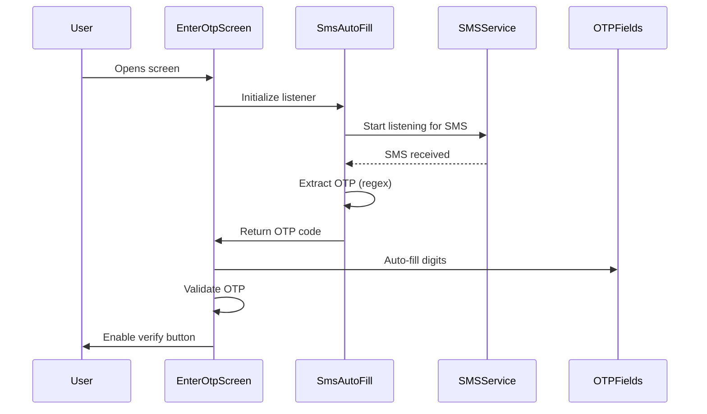

# Design Document: Automatic OTP Reading

## Overview

This design implements automatic OTP reading functionality for the EnterOtpScreen using platform-specific SMS detection mechanisms. The solution uses the `sms_autofill` package for Android (which leverages SMS Retriever API) and provides graceful fallback for iOS. The implementation focuses on security, user privacy, and seamless integration with the existing OTP verification flow.

## Architecture

### High-Level Architecture

```
┌─────────────────────────────────────────────────────────┐
│                   EnterOtpScreen                        │
│  ┌───────────────────────────────────────────────────┐ │
│  │         OTP Auto-Fill Manager                     │ │
│  │  - Initialize SMS listener                        │ │
│  │  - Handle permissions                             │ │
│  │  - Extract and validate OTP                       │ │
│  │  - Auto-fill fields                               │ │
│  └───────────────────────────────────────────────────┘ │
│                         │                               │
│                         ▼                               │
│  ┌───────────────────────────────────────────────────┐ │
│  │         sms_autofill Package                      │ │
│  │  - Listen for SMS (Android)                       │ │
│  │  - Request app signature (Android)                │ │
│  │  - Handle platform differences                    │ │
│  └───────────────────────────────────────────────────┘ │
└─────────────────────────────────────────────────────────┘
```

### Component Interaction Flow



## Components and Interfaces

### 1. SMS Auto-Fill Integration

**Package:** `sms_autofill: ^2.4.0`

**Key Features:**
- Android SMS Retriever API integration
- Automatic OTP code extraction
- App signature generation for SMS filtering
- Permission handling

**Implementation in EnterOtpScreen:**

```dart
class _EnterOtpScreenState extends State<EnterOtpScreen> with CodeAutoFill {
  String? _otpCode;
  
  @override
  void initState() {
    super.initState();
    _initializeSmsListener();
  }
  
  void _initializeSmsListener() async {
    // Listen for OTP code
    await listenForCode();
    
    // Get app signature for SMS filtering (Android)
    final signature = await SmsAutoFill().getAppSignature;
    debugPrint('App Signature: $signature');
  }
  
  @override
  void codeUpdated() {
    // Called when OTP is detected
    if (code != null && code!.length == 6) {
      _autoFillOtp(code!);
    }
  }
  
  @override
  void dispose() {
    cancel(); // Stop listening
    super.dispose();
  }
}
```

### 2. OTP Extraction Logic

**Regex Pattern:** `\b\d{6}\b`

This pattern extracts any 6-digit number from the SMS message body.

**Message Format Expected:**
```
Your ASKIT health verification code is 908726. Valid for 5 minutes. Do not share with anyone.
```

**Extraction Function:**

```dart
String? _extractOtpFromMessage(String message) {
  final RegExp otpRegex = RegExp(r'\b\d{6}\b');
  final match = otpRegex.firstMatch(message);
  return match?.group(0);
}
```

### 3. Auto-Fill Implementation

**Method to populate OTP fields:**

```dart
void _autoFillOtp(String otp) {
  if (otp.length != 6) return;
  
  // Check if user has already started typing
  final hasUserInput = _controllers.any((c) => c.text.isNotEmpty);
  if (hasUserInput) return; // Don't override user input
  
  // Fill each digit
  for (int i = 0; i < 6; i++) {
    _controllers[i].text = otp[i];
  }
  
  // Trigger validation
  _validateOtp();
  
  // Dismiss keyboard
  _closeKeyboard();
  
  // Optional: Show subtle feedback
  _showAutoFillFeedback();
  
  setState(() {});
}
```

### 4. Permission Handling

**Android Permissions (AndroidManifest.xml):**

```xml
<uses-permission android:name="android.permission.RECEIVE_SMS" />
<uses-permission android:name="android.permission.READ_SMS" />
<!-- For Android 8.0+ SMS Retriever API -->
<uses-permission android:name="android.permission.READ_PHONE_STATE" />
```

**Runtime Permission Request:**

```dart
Future<void> _requestSmsPermission() async {
  final status = await Permission.sms.status;
  
  if (status.isDenied) {
    final result = await Permission.sms.request();
    if (result.isGranted) {
      _initializeSmsListener();
    }
  }
}
```

**Note:** The `sms_autofill` package uses SMS Retriever API on Android 8.0+, which doesn't require explicit SMS permissions for OTP reading, making it more privacy-friendly.

### 5. Platform-Specific Handling

**Android:**
- Uses SMS Retriever API (no permission required for OTP)
- Requires app signature in SMS message (optional, for enhanced security)
- Automatic detection and extraction

**iOS:**
- Limited SMS access due to platform restrictions
- Can use iOS 12+ autofill from keyboard suggestion
- Manual entry remains primary method

**Implementation:**

```dart
void _initializeSmsListener() async {
  if (Platform.isAndroid) {
    await listenForCode();
  } else if (Platform.isIOS) {
    // iOS uses system-level autofill
    // No additional implementation needed
  }
}
```

## Data Models

### OTP State Management

```dart
class OtpState {
  final String otp;
  final bool isAutoFilled;
  final bool isValid;
  final bool isComplete;
  
  OtpState({
    required this.otp,
    this.isAutoFilled = false,
    this.isValid = false,
    this.isComplete = false,
  });
}
```

## Error Handling

### Error Scenarios and Handling

1. **SMS Permission Denied**
   - Gracefully continue with manual entry
   - Show informational message (optional)
   - Don't block user flow

2. **SMS Detection Failure**
   - Log error for debugging
   - Fall back to manual entry
   - No user-facing error message

3. **Invalid OTP Format**
   - Ignore the SMS
   - Continue listening for valid OTP
   - Allow manual entry

4. **Platform Not Supported**
   - Detect platform at initialization
   - Skip SMS listener setup
   - Use manual entry only

**Error Handling Implementation:**

```dart
void _initializeSmsListener() async {
  try {
    if (Platform.isAndroid) {
      await listenForCode();
    }
  } catch (e) {
    debugPrint('SMS Auto-fill initialization failed: $e');
    // Continue with manual entry - no user notification needed
  }
}

@override
void codeUpdated() {
  try {
    if (code != null && code!.length == 6 && RegExp(r'^\d{6}$').hasMatch(code!)) {
      _autoFillOtp(code!);
    }
  } catch (e) {
    debugPrint('Auto-fill failed: $e');
    // Fail silently - user can still enter manually
  }
}
```

## Testing Strategy

### Unit Tests

1. **OTP Extraction Tests**
   - Test regex pattern with valid messages
   - Test with invalid formats
   - Test with multiple numbers in message
   - Test with non-numeric characters

2. **Auto-Fill Logic Tests**
   - Test field population with valid OTP
   - Test prevention of override when user has typed
   - Test validation trigger after auto-fill

### Integration Tests

1. **SMS Listener Tests**
   - Mock SMS reception
   - Verify listener initialization
   - Verify cleanup on dispose

2. **Permission Flow Tests**
   - Test permission request flow
   - Test behavior when permission denied
   - Test behavior when permission granted

### Manual Testing Checklist

1. **Android Testing**
   - [ ] Send test SMS with correct format
   - [ ] Verify OTP auto-fills correctly
   - [ ] Test with permission denied
   - [ ] Test with user already typing
   - [ ] Test with incorrect SMS format

2. **iOS Testing**
   - [ ] Verify manual entry works
   - [ ] Test system autofill suggestions (iOS 12+)
   - [ ] Verify no crashes on iOS

3. **Edge Cases**
   - [ ] Multiple SMS received quickly
   - [ ] SMS received after user started typing
   - [ ] SMS with wrong format
   - [ ] App in background when SMS arrives

## Security Considerations

1. **SMS Access Scope**
   - Only read OTP messages (using SMS Retriever API on Android)
   - Don't store SMS content
   - Stop listening after OTP received or screen closed

2. **Data Privacy**
   - No SMS data sent to backend
   - No persistent storage of SMS content
   - Only extract necessary OTP digits

3. **Permission Best Practices**
   - Use SMS Retriever API (no permission needed on Android 8+)
   - Clear explanation if permission requested
   - Graceful degradation if denied

4. **Code Validation**
   - Validate OTP format before auto-fill
   - Verify 6-digit numeric pattern
   - Prevent injection of invalid data

## Implementation Notes

1. **Package Addition**
   - Add `sms_autofill: ^2.4.0` to pubspec.yaml
   - Run `flutter pub get`

2. **Android Configuration**
   - No additional manifest changes needed for SMS Retriever API
   - Optional: Add app signature to SMS message for enhanced filtering

3. **iOS Considerations**
   - iOS has built-in OTP autofill from keyboard
   - No additional code needed for iOS
   - System handles it automatically

4. **User Experience**
   - Auto-fill should be seamless and fast
   - No intrusive notifications
   - Manual entry always available as fallback
   - Don't override user input

5. **Cleanup**
   - Always call `cancel()` in dispose
   - Stop listening when verification succeeds
   - Prevent memory leaks from active listeners
