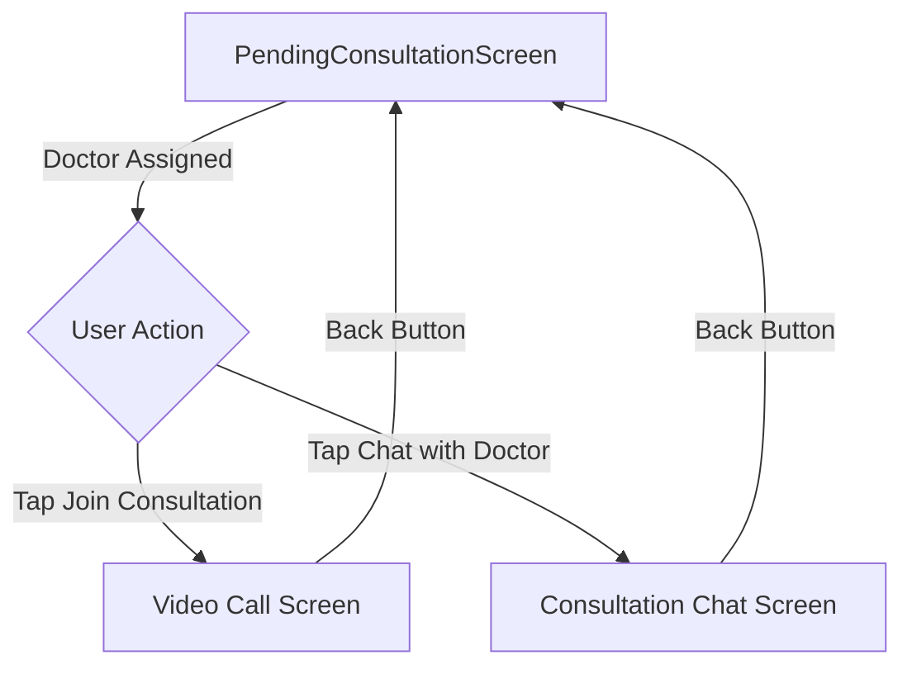

# Design Document

## Overview

This design document outlines the implementation of a chat follow-up feature for the PendingConsultationScreen. The feature adds a "Chat with Doctor" button that allows patients to initiate text-based conversations with their assigned doctors. Additionally, the app bar will be enhanced with a more professional design that includes better visual hierarchy, consistent styling, and improved user experience.

The implementation will integrate seamlessly with the existing consultation flow and maintain consistency with the app's design system.

## Architecture

### Component Structure

```
lib/
├── consultation_pending/
│   ├── ui/
│   │   ├── pending_consultation_screen.dart (modified)
│   │   └── components/
│   │       └── (existing components)
│   └── entities/
│       └── appointment_detail.dart (existing)
├── chat/
│   ├── ui/
│   │   └── consultation_chat_screen.dart (new)
│   ├── entities/
│   │   └── chat_config.dart (new)
│   └── controller/
│       └── consultation_chat_controller.dart (new)
└── _shared/
    ├── routing/
    │   └── app_routes.dart (modified)
    └── ui/
        └── app_colors.dart (existing)
```

### Navigation Flow



## Components and Interfaces

### 1. Enhanced App Bar Component

The app bar will be redesigned with the following specifications:

**Visual Design:**
- Background: White (`Colors.white`)
- Elevation: 2.0 (subtle shadow for depth)
- Height: Standard AppBar height (56dp)
- Title: "Consultation" centered, font weight 700, size 18
- Foreground color: Dark gray (`Colors.grey.shade900`)

**Back Button:**
- Icon: `Icons.arrow_back_ios_rounded`
- Size: 20
- Color: Matches foreground color
- Touch target: 48x48 dp (standard)

**Optional Actions:**
- Support for trailing action buttons (e.g., info, settings)
- Consistent icon sizing and spacing

### 2. Chat Button Component

**Design Specifications:**
- Style: Outlined button (secondary action)
- Height: 56dp
- Width: Full width with horizontal padding
- Border: 2px solid `AppColors.primaryGreen`
- Background: Transparent/White
- Text color: `AppColors.primaryGreen`
- Border radius: 16dp
- Icon: `Icons.chat_bubble_outline_rounded`
- Icon size: 22
- Spacing between icon and text: 12dp

**Button States:**
- Default: Outlined with primary color
- Pressed: Light green background (`AppColors.primaryGreen.withAlpha(20)`)
- Disabled: Gray border and text (`Colors.grey.shade300`)

**Layout Position:**
- Placed below the "Join Consultation" button
- Vertical spacing: 16dp from the button above
- Horizontal padding: 20dp from screen edges

### 3. Chat Configuration Entity

```dart
class ChatConfig {
  final String appointmentId;
  final String doctorId;
  final String doctorName;
  final String doctorSpecialization;
  final String doctorImageUrl;
  final String patientId;
  final String patientName;
  
  ChatConfig({
    required this.appointmentId,
    required this.doctorId,
    required this.doctorName,
    required this.doctorSpecialization,
    required this.doctorImageUrl,
    required this.patientId,
    required this.patientName,
  });
  
  bool isValid() {
    return appointmentId.isNotEmpty &&
        doctorId.isNotEmpty &&
        doctorName.isNotEmpty &&
        patientId.isNotEmpty;
  }
}
```

### 4. Consultation Chat Screen

**Screen Structure:**
- App bar with doctor info
- Message list (scrollable)
- Message input field at bottom
- Send button

**App Bar Design:**
- Leading: Back button
- Title: Doctor name
- Subtitle: Specialization
- Avatar: Doctor profile image (circular, 40dp)
- Background: White with elevation

**Message List:**
- Reverse scroll (newest at bottom)
- Message bubbles with timestamps
- Sender/receiver differentiation
- Loading indicator for initial load
- Empty state for no messages

**Input Field:**
- Text field with hint "Type your message..."
- Send button (icon button)
- Keyboard handling
- Character limit indicator (optional)

## Data Models

### ChatConfig Entity

Located at: `lib/chat/entities/chat_config.dart`

```dart
class ChatConfig {
  final String appointmentId;
  final String doctorId;
  final String doctorName;
  final String doctorSpecialization;
  final String doctorImageUrl;
  final String patientId;
  final String patientName;
  
  ChatConfig({
    required this.appointmentId,
    required this.doctorId,
    required this.doctorName,
    required this.doctorSpecialization,
    required this.doctorImageUrl,
    required this.patientId,
    required this.patientName,
  });
  
  bool isValid() {
    return appointmentId.isNotEmpty &&
        doctorId.isNotEmpty &&
        doctorName.isNotEmpty &&
        patientId.isNotEmpty;
  }
  
  String? getValidationError() {
    if (appointmentId.isEmpty) return 'Appointment ID is missing';
    if (doctorId.isEmpty) return 'Doctor ID is missing';
    if (doctorName.isEmpty) return 'Doctor name is missing';
    if (patientId.isEmpty) return 'Patient ID is missing';
    return null;
  }
}
```

### Message Entity (Placeholder)

For the initial implementation, we'll create a basic message structure:

```dart
class ChatMessage {
  final String id;
  final String senderId;
  final String senderName;
  final String message;
  final DateTime timestamp;
  final bool isFromDoctor;
  
  ChatMessage({
    required this.id,
    required this.senderId,
    required this.senderName,
    required this.message,
    required this.timestamp,
    required this.isFromDoctor,
  });
}
```

## Error Handling

### Navigation Errors

**Scenario:** Chat navigation fails due to missing data
- **Handling:** Display SnackBar with error message
- **Message:** "Unable to start chat: Missing required information"
- **Recovery:** User remains on consultation screen

### Validation Errors

**Scenario:** ChatConfig validation fails
- **Handling:** Log error and show user-friendly message
- **Message:** "Unable to start chat. Please try again later."
- **Recovery:** User can retry or use video consultation

### Network Errors (Future)

**Scenario:** Chat service unavailable
- **Handling:** Display error state in chat screen
- **Message:** "Unable to connect to chat service"
- **Recovery:** Retry button, fallback to video consultation

## Testing Strategy

### Unit Tests

1. **ChatConfig Validation**
   - Test `isValid()` with complete data
   - Test `isValid()` with missing required fields
   - Test `getValidationError()` returns correct messages

2. **Button State Logic**
   - Test button enabled when doctor assigned
   - Test button disabled when doctor not assigned
   - Test button visibility conditions

### Widget Tests

1. **App Bar Rendering**
   - Verify title text and styling
   - Verify back button presence and functionality
   - Verify elevation and colors

2. **Chat Button Rendering**
   - Verify button text and icon
   - Verify button styling (outlined, colors)
   - Verify button positioning and spacing
   - Verify button states (enabled/disabled)

3. **Navigation**
   - Test navigation to chat screen with valid config
   - Test navigation failure handling
   - Test back navigation from chat screen

### Integration Tests

1. **End-to-End Chat Flow**
   - Load consultation screen
   - Verify doctor assigned state
   - Tap chat button
   - Verify navigation to chat screen
   - Verify chat screen displays correct doctor info
   - Navigate back to consultation screen

2. **Visual Consistency**
   - Verify app bar matches design specifications
   - Verify button styling matches design system
   - Verify spacing and layout consistency

## UI/UX Considerations

### Visual Hierarchy

1. **Primary Action:** "Join Consultation" button (filled, prominent)
2. **Secondary Action:** "Chat with Doctor" button (outlined, less prominent)
3. **Clear Differentiation:** Visual distinction between primary and secondary actions

### Accessibility

1. **Touch Targets:** Minimum 48x48 dp for all interactive elements
2. **Contrast Ratios:** Sufficient contrast for text and icons (WCAG AA)
3. **Semantic Labels:** Proper labels for screen readers
4. **Focus Indicators:** Clear focus states for keyboard navigation

### Responsive Design

1. **Button Sizing:** Full-width buttons adapt to screen width
2. **Spacing:** Consistent padding and margins across screen sizes
3. **Text Scaling:** Support for system font size preferences

### Loading States

1. **Initial Load:** Show loading indicator while fetching consultation data
2. **Navigation:** Brief loading state during screen transition
3. **Error States:** Clear error messages with retry options

## Implementation Notes

### Phase 1: UI Enhancement (Current Scope)

1. Update app bar design in PendingConsultationScreen
2. Add "Chat with Doctor" button below "Join Consultation" button
3. Create ChatConfig entity
4. Add navigation route for chat screen
5. Create basic ConsultationChatScreen with placeholder UI

### Phase 2: Chat Functionality (Future)

1. Implement real-time messaging service
2. Add message persistence
3. Implement push notifications for new messages
4. Add typing indicators
5. Add message read receipts

### Dependencies

- **GetX:** For navigation and state management
- **Existing Design System:** AppColors, typography, spacing constants
- **Network Layer:** For future chat API integration

### Code Style Guidelines

1. Follow existing Flutter/Dart conventions
2. Use GetX patterns for navigation and state management
3. Maintain consistency with existing UI components
4. Use meaningful variable and function names
5. Add comments for complex logic
6. Follow the app's existing file structure and naming conventions
