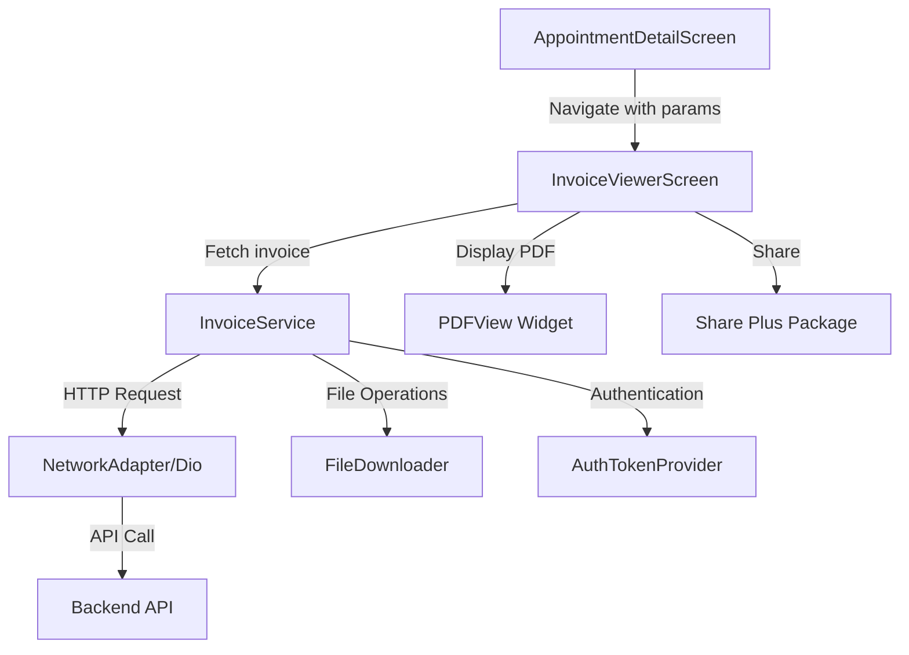
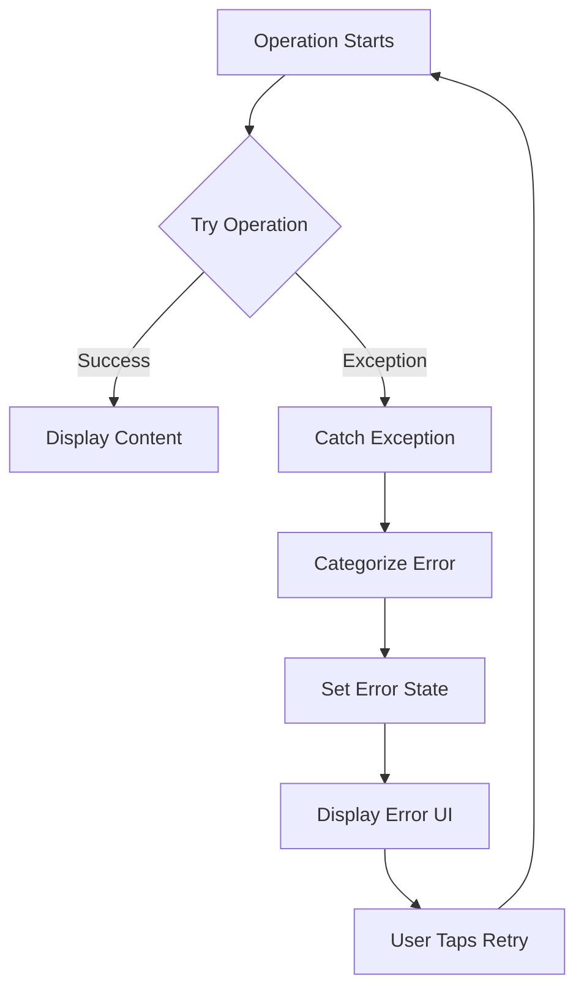

# Design Document: Invoice Viewer

## Overview

The Invoice Viewer feature enables patients to view, download, and share appointment invoices in PDF format. The design follows the existing PrescriptionViewerScreen pattern to maintain consistency and leverage proven architecture. The feature consists of three main components: InvoiceViewerScreen (UI), InvoiceService (business logic), and integration with AppointmentDetailScreen.

## Architecture

### High-Level Architecture

```
AppointmentDetailScreen
        ↓ (navigation)
InvoiceViewerScreen
        ↓ (uses)
InvoiceService
        ↓ (uses)
[NetworkAdapter, FileDownloader, AuthTokenProvider]
```

### Component Diagram



## Components and Interfaces

### 1. InvoiceService

**Purpose:** Handles all invoice-related operations including fetching, caching, and downloading.

**Location:** `lib/appointment/service/invoice_service.dart`

**Interface:**

```dart
class InvoiceService {
  // Singleton pattern
  InvoiceService._();
  static final InvoiceService _instance = InvoiceService._();
  factory InvoiceService() => _instance;

  /// Downloads invoice to temporary cache for viewing
  /// Returns local file path if successful, null otherwise
  Future<String?> fetchInvoiceForViewing({
    required String appointmentId,
    Function(int received, int total)? onProgress,
  });

  /// Downloads invoice permanently to device storage
  /// Returns true if successful, false otherwise
  Future<bool> downloadInvoicePermanently({
    required String appointmentId,
    required String fileName,
    Function(int received, int total)? onProgress,
  });

  /// Gets cached invoice file path if exists
  /// Returns file path if cached, null otherwise
  Future<String?> getCachedInvoicePath(String appointmentId);

  /// Clears temporary invoice cache
  Future<void> clearCache();
}
```

**Implementation Details:**
- Uses Dio for HTTP requests with authentication headers
- Caches invoices in temporary directory: `{temp}/invoice_cache/invoice_{appointment_id}.pdf`
- Downloads permanently using FileDownloader utility
- API endpoint: `{base_url}/patient/appointments/{appointment_id}/invoice`
- Includes progress callbacks for download tracking

### 2. InvoiceViewerScreen

**Purpose:** Displays invoice PDF with view, download, and share capabilities.

**Location:** `lib/appointment/ui/invoice_viewer_screen.dart`

**Interface:**

```dart
class InvoiceViewerScreen extends StatefulWidget {
  final String appointmentId;
  final String doctorName;

  const InvoiceViewerScreen({
    super.key,
    required this.appointmentId,
    required this.doctorName,
  });
}
```

**State Management:**

```dart
class _InvoiceViewerScreenState extends State<InvoiceViewerScreen> {
  // Services
  final _invoiceService = InvoiceService();
  PDFViewController? _pdfViewController;
  
  // State variables
  bool _isLoading = true;
  bool _hasError = false;
  String? _errorMessage;
  String? _localFilePath;
  int _currentPage = 0;
  int _totalPages = 0;
  bool _isDownloading = false;
  double _downloadProgress = 0.0;

  // Methods
  Future<void> _loadInvoice();
  Future<void> _downloadInvoice();
  Future<void> _shareInvoice();
  void _retry();
  String _getErrorMessage(dynamic error);
}
```

**UI Structure:**

```
Scaffold
├── AppBar
│   ├── Back Button
│   ├── Title: "Invoice - Dr. {doctor_name}"
│   ├── Download Button (with progress indicator)
│   └── Share Button
└── Body
    ├── Loading State (CircularProgressIndicator + text)
    ├── Error State (Icon + message + retry button)
    └── PDF Viewer State
        ├── PDFView Widget
        └── Page Indicator Overlay (bottom center)
```

### 3. AppointmentDetailScreen Integration

**Purpose:** Wire up the "Download Receipt" button to navigate to InvoiceViewerScreen.

**Location:** `lib/appointment/appointment_detail_screen.dart`

**Changes Required:**

```dart
// In the Download Receipt button onPressed handler
OutlinedButton(
  onPressed: () {
    Get.to(() => InvoiceViewerScreen(
      appointmentId: widget.appointment.id.toString(),
      doctorName: widget.appointment.doctorName,
    ));
  },
  // ... existing button styling
)
```

## Data Models

### Invoice Response (from API)

The API returns a PDF file directly (binary data), not JSON. The response headers will include:
- `Content-Type: application/pdf`
- `Content-Disposition: attachment; filename="invoice_{appointment_id}.pdf"`

No additional data models are needed as we're working directly with PDF binary data.

## Correctness Properties

*A property is a characteristic or behavior that should hold true across all valid executions of a system—essentially, a formal statement about what the system should do. Properties serve as the bridge between human-readable specifications and machine-verifiable correctness guarantees.*

### Property 1: Invoice Fetch Idempotence
*For any* appointment ID, fetching the invoice multiple times should return the same cached file path without making redundant network requests.
**Validates: Requirements 6.2**

### Property 2: Download Progress Monotonicity
*For any* download operation, the progress values reported should be monotonically increasing (never decrease) until completion.
**Validates: Requirements 2.3**

### Property 3: File Path Validity
*For any* successfully fetched or downloaded invoice, the returned file path should point to an existing, readable PDF file.
**Validates: Requirements 1.4, 2.2**

### Property 4: Error Message Specificity
*For any* error type (network, auth, 404, permission), the error message displayed should match the specific error category.
**Validates: Requirements 5.1, 5.2, 5.3, 5.4**

### Property 5: Navigation State Consistency
*For any* download in progress, attempting to navigate back should be prevented and show a blocking message.
**Validates: Requirements 7.3**

### Property 6: Cache Consistency
*For any* appointment ID, if a cached invoice exists, `getCachedInvoicePath` should return the same path as `fetchInvoiceForViewing` without network calls.
**Validates: Requirements 6.2**

## Error Handling

### Error Categories and Messages

| Error Type | Detection | User Message | Action |
|------------|-----------|--------------|--------|
| Network Error | Exception contains 'network' or 'connection' | "Unable to load invoice. Please check your internet connection." | Retry button |
| Not Found (404) | HTTP 404 or 'not found' | "Invoice not available. Please contact support." | Retry button |
| Authentication | Exception contains 'auth' or 'token' | "Session expired. Please log in again." | Retry button |
| Permission Denied | Exception contains 'permission' | "Unable to save file. Please check storage permissions." | Retry button |
| Generic Error | Any other exception | "Unable to load invoice. Please try again." | Retry button |

### Error Handling Flow



### Implementation Pattern

```dart
String _getErrorMessage(dynamic error) {
  final errorString = error.toString().toLowerCase();
  
  if (errorString.contains('network') || errorString.contains('connection')) {
    return 'Unable to load invoice. Please check your internet connection.';
  } else if (errorString.contains('permission')) {
    return 'Unable to save file. Please check storage permissions.';
  } else if (errorString.contains('auth') || errorString.contains('token')) {
    return 'Session expired. Please log in again.';
  } else if (errorString.contains('not found') || errorString.contains('404')) {
    return 'Invoice not available. Please contact support.';
  } else {
    return 'Unable to load invoice. Please try again.';
  }
}
```

## Testing Strategy

### Unit Tests

**InvoiceService Tests:**
- Test successful invoice fetch with valid appointment ID
- Test cache hit scenario (second fetch returns cached path)
- Test download progress callback invocation
- Test permanent download to Downloads folder
- Test cache clearing functionality
- Test error handling for network failures
- Test error handling for invalid appointment IDs

**Error Message Tests:**
- Test error categorization for network errors
- Test error categorization for 404 errors
- Test error categorization for auth errors
- Test error categorization for permission errors
- Test generic error fallback

### Integration Tests

**InvoiceViewerScreen Tests:**
- Test navigation from AppointmentDetailScreen with correct parameters
- Test loading state display during fetch
- Test successful PDF display after fetch
- Test error state display on fetch failure
- Test retry functionality after error
- Test download button functionality
- Test share button functionality
- Test back navigation blocking during download
- Test page indicator updates during PDF navigation

### Property-Based Tests

Each correctness property should be implemented as a property-based test with minimum 100 iterations:

**Property 1 Test:**
```dart
// Feature: invoice-viewer, Property 1: Invoice Fetch Idempotence
// For any appointment ID, multiple fetches return same cached path
test('invoice fetch idempotence', () async {
  // Generate random appointment IDs
  // Fetch twice for each ID
  // Verify second fetch returns cached path without network call
  // Verify both paths are identical
});
```

**Property 2 Test:**
```dart
// Feature: invoice-viewer, Property 2: Download Progress Monotonicity
// For any download, progress values never decrease
test('download progress monotonicity', () async {
  // Track all progress callbacks
  // Verify each value >= previous value
  // Verify final value is 100%
});
```

**Property 3 Test:**
```dart
// Feature: invoice-viewer, Property 3: File Path Validity
// For any successful operation, returned path points to valid PDF
test('file path validity', () async {
  // Fetch/download invoices
  // Verify file exists at returned path
  // Verify file is readable
  // Verify file has PDF signature
});
```

**Property 4 Test:**
```dart
// Feature: invoice-viewer, Property 4: Error Message Specificity
// For any error type, message matches error category
test('error message specificity', () async {
  // Simulate different error types
  // Verify error message contains expected keywords
  // Verify no generic message for specific errors
});
```

**Property 5 Test:**
```dart
// Feature: invoice-viewer, Property 5: Navigation State Consistency
// For any download in progress, back navigation is blocked
test('navigation blocking during download', () async {
  // Start download
  // Attempt back navigation
  // Verify navigation is prevented
  // Verify blocking message is shown
});
```

**Property 6 Test:**
```dart
// Feature: invoice-viewer, Property 6: Cache Consistency
// For any cached invoice, getCachedPath returns same as fetch
test('cache consistency', () async {
  // Fetch invoice (creates cache)
  // Call getCachedInvoicePath
  // Verify paths match
  // Verify no network call on second operation
});
```

## UI/UX Specifications

### Color Scheme
- Primary Green: `AppColors.primaryGreen` (buttons, indicators)
- Primary Blue: `AppColors.primaryBlue` (share button)
- Grey 50: `AppColors.grey50` (background)
- Grey 100: `AppColors.grey100` (PDF viewer background)
- Grey 400: `AppColors.grey400` (disabled states)
- Grey 600: `AppColors.grey600` (secondary text)
- Error Red: `AppColors.errorRed` (error messages)
- Success Green: `AppColors.successGreen` (success messages)

### Typography
- App Bar Title: 17px, FontWeight.w600, black87
- Loading Text: 16px, FontWeight.w500, grey600
- Error Title: 18px, FontWeight.w600, black87
- Error Message: 15px, grey600
- Button Text: 15px, FontWeight.w600
- Page Indicator: 14px, FontWeight.w600, white

### Spacing
- App Bar Height: Default (56px)
- Button Height: 48px
- Icon Size: 20px (buttons), 80px (error state)
- Padding: 20px (horizontal), 24px (vertical for buttons)
- Border Radius: 12px (buttons), 24px (page indicator), 10px (snackbars)

### Animations
- Page Indicator: Fade in/out on page change
- Download Progress: Smooth progress bar animation
- Loading Spinner: Continuous rotation
- Snackbar: Slide up from bottom with fade

### Responsive Behavior
- PDF scales to fit screen width
- Page indicator positioned 24px from bottom
- Buttons maintain minimum touch target of 48x48px
- Error messages wrap text appropriately

## Dependencies

### Existing Dependencies (Already in pubspec.yaml)
- `flutter_pdfview: ^1.3.2` - PDF viewing
- `dio: ^5.4.0` - HTTP requests
- `path_provider: ^2.1.2` - File system paths
- `share_plus: ^7.2.1` - Sharing functionality
- `get: ^4.6.6` - Navigation and state management

### New Dependencies
None required - all necessary packages are already included.

## Implementation Notes

### File Naming Convention
- Cache files: `invoice_{appointment_id}.pdf`
- Downloaded files: `invoice_{appointment_id}.pdf`
- Cache directory: `{temp}/invoice_cache/`

### API Integration
- Endpoint: `GET {base_url}/patient/appointments/{appointment_id}/invoice`
- Authentication: Bearer token via AuthTokenProvider
- Response: Binary PDF data
- Headers: `Accept: application/json`, `Authorization: Bearer {token}`

### Performance Considerations
- Cache invoices in temporary storage to avoid redundant downloads
- Use progress callbacks for large file downloads
- Lazy load PDF pages for better memory management
- Clear cache periodically to manage storage

### Security Considerations
- Always include authentication token in requests
- Validate appointment ID belongs to current user (handled by backend)
- Use HTTPS for all API calls
- Don't log sensitive invoice data

## Migration and Rollout

### Phase 1: Service Layer
1. Create InvoiceService with all methods
2. Write unit tests for InvoiceService
3. Verify API integration with backend

### Phase 2: UI Layer
1. Create InvoiceViewerScreen
2. Implement loading, error, and PDF viewer states
3. Add download and share functionality
4. Write integration tests

### Phase 3: Integration
1. Wire up "Download Receipt" button in AppointmentDetailScreen
2. Test end-to-end flow
3. Verify error handling and edge cases

### Phase 4: Testing and Polish
1. Run all property-based tests
2. Test on different devices and screen sizes
3. Verify accessibility compliance
4. Performance testing with large PDFs

## Future Enhancements

### Potential Improvements (Not in Current Scope)
- Offline mode with persistent cache
- Invoice history view (list of all invoices)
- Print functionality
- Email invoice directly from app
- Invoice search and filtering
- Multiple invoice selection for batch operations
- Invoice annotations and notes
