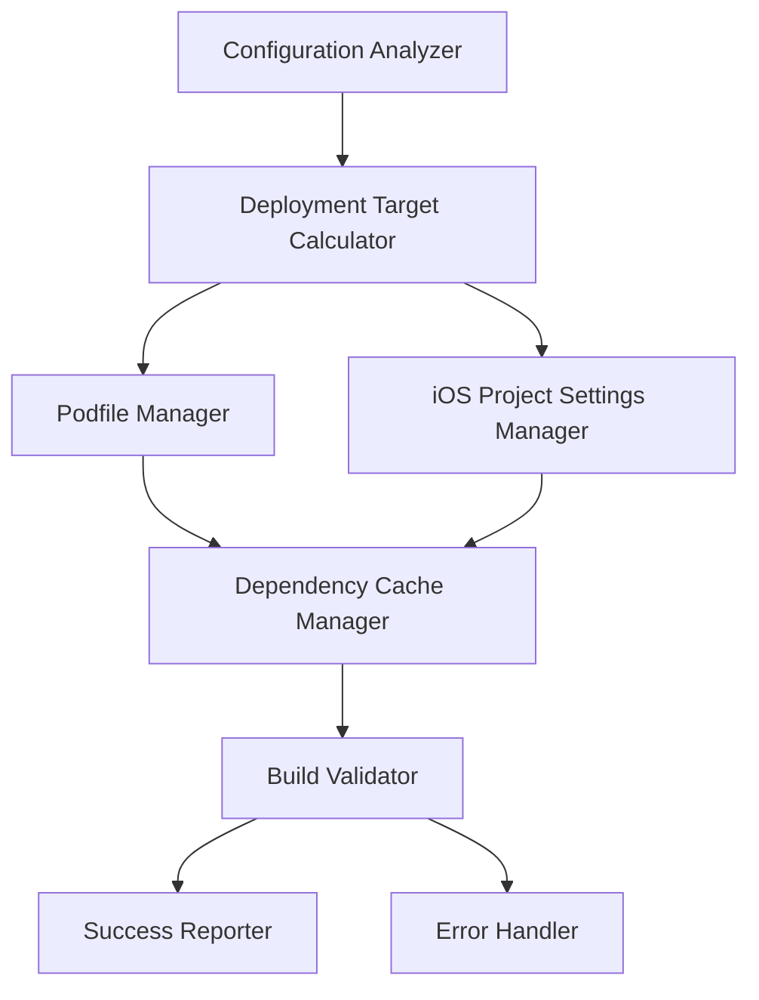

# Design Document: iOS Build Resolution

## Overview

This design provides a comprehensive solution for resolving iOS build issues in Flutter projects caused by CocoaPods compatibility errors. The system addresses deployment target mismatches between Flutter SDK requirements, plugin dependencies, and iOS project configurations. Based on research, Flutter 3.8.1 and modern CocoaPods dependencies typically require iOS 12.0 as the minimum deployment target, with some plugins requiring even higher versions.

The solution follows a systematic approach: analyze current configuration, determine optimal deployment target, update all relevant configuration files, clean dependency caches, and verify the build works correctly.

## Architecture

The iOS build resolution system consists of several interconnected components that work together to ensure compatibility:



The architecture follows a pipeline pattern where each component validates and updates specific aspects of the iOS build configuration. The Configuration Analyzer examines the current state, the Deployment Target Calculator determines the optimal target version, and subsequent components apply the necessary changes.

## Components and Interfaces

### Configuration Analyzer

**Purpose**: Examines current Flutter project configuration to identify iOS deployment target issues.

**Key Methods**:
- `analyzeFlutterVersion()`: Determines Flutter SDK version and minimum iOS requirements
- `scanPluginDependencies()`: Examines pubspec.yaml and identifies plugin iOS version requirements  
- `checkCurrentPodfile()`: Analyzes existing Podfile configuration
- `validateiOSProjectSettings()`: Reviews Xcode project deployment target settings

**Inputs**: Flutter project directory, pubspec.yaml, Podfile, iOS project files
**Outputs**: Configuration analysis report with current state and identified issues

### Deployment Target Calculator

**Purpose**: Determines the optimal iOS deployment target based on Flutter SDK and plugin requirements.

**Key Methods**:
- `calculateMinimumTarget()`: Determines minimum required iOS version
- `validatePluginCompatibility()`: Checks each plugin's iOS version requirements
- `resolveVersionConflicts()`: Handles cases where plugins require different minimum versions

**Logic**: 
- Flutter 3.8.1+ requires iOS 12.0 minimum
- Scans all plugins for minimum iOS version requirements
- Selects the highest required version among Flutter SDK and all plugins
- Validates against supported iOS version ranges

### Podfile Manager

**Purpose**: Updates and manages Podfile configuration for proper CocoaPods dependency resolution.

**Key Methods**:
- `updatePlatformDeclaration()`: Sets or updates the iOS platform version
- `addPostInstallScript()`: Adds script to ensure consistent deployment targets across pods
- `preserveExistingConfiguration()`: Maintains existing pod dependencies and custom configurations
- `validateSyntax()`: Ensures Podfile syntax is correct after modifications

**Configuration Updates**:
- Uncomments or adds `platform :ios, 'X.X'` declaration
- Adds post_install hook to set IPHONEOS_DEPLOYMENT_TARGET for all pods
- Preserves existing pod declarations and custom configurations

### iOS Project Settings Manager

**Purpose**: Synchronizes iOS project settings with Podfile configuration.

**Key Methods**:
- `updateRunnerTarget()`: Updates main Runner target deployment settings
- `updateAllTargets()`: Ensures all targets use consistent deployment version
- `updateInfoPlist()`: Updates MinimumOSVersion in Info.plist files
- `validateProjectConsistency()`: Verifies all settings are synchronized

**Files Modified**:
- `ios/Runner.xcodeproj/project.pbxproj`: Updates IPHONEOS_DEPLOYMENT_TARGET
- `ios/Runner/Info.plist`: Updates MinimumOSVersion
- `ios/Flutter/AppFrameworkInfo.plist`: Updates MinimumOSVersion

### Dependency Cache Manager

**Purpose**: Cleans and rebuilds iOS dependencies after configuration changes.

**Key Methods**:
- `cleanPodCache()`: Removes Pods directory and Podfile.lock
- `cleanFlutterCache()`: Clears Flutter's iOS build cache
- `reinstallDependencies()`: Runs pod install with updated configuration
- `verifyInstallation()`: Confirms successful dependency installation

**Cleanup Process**:
1. Remove `ios/Pods` directory
2. Delete `ios/Podfile.lock`
3. Run `flutter clean`
4. Execute `pod install` in iOS directory
5. Verify no CocoaPods errors occur

### Build Validator

**Purpose**: Validates that iOS build works correctly after applying all fixes.

**Key Methods**:
- `performCleanBuild()`: Attempts a clean iOS build
- `validatePluginIntegration()`: Ensures all plugins are properly integrated
- `checkForErrors()`: Scans build output for remaining compatibility issues
- `generateReport()`: Provides detailed success or failure information

## Data Models

### ConfigurationState

```typescript
interface ConfigurationState {
  flutterVersion: string;
  currentiOSTarget: string;
  podfileExists: boolean;
  podfilePlatformDeclared: boolean;
  pluginRequirements: PluginRequirement[];
  projectSettings: ProjectSettings;
}
```

### PluginRequirement

```typescript
interface PluginRequirement {
  name: string;
  minimumIOSVersion: string;
  source: 'pubspec' | 'podspec';
  compatible: boolean;
}
```

### ProjectSettings

```typescript
interface ProjectSettings {
  runnerTargetVersion: string;
  infoPlistVersion: string;
  appFrameworkVersion: string;
  allTargetsConsistent: boolean;
}
```

### ResolutionPlan

```typescript
interface ResolutionPlan {
  targetIOSVersion: string;
  podfileUpdates: PodfileUpdate[];
  projectUpdates: ProjectUpdate[];
  cleanupRequired: boolean;
  estimatedCompatibility: 'high' | 'medium' | 'low';
}
```

Now I need to use the prework tool to analyze the acceptance criteria before writing the Correctness Properties section:
## Correctness Properties

*A property is a characteristic or behavior that should hold true across all valid executions of a system—essentially, a formal statement about what the system should do. Properties serve as the bridge between human-readable specifications and machine-verifiable correctness guarantees.*

Based on the prework analysis and property reflection, the following properties ensure the iOS build resolution system works correctly:

### Property 1: Version Resolution Accuracy
*For any* Flutter SDK version 3.8.1 or higher and any set of plugin dependencies, the system should calculate the deployment target as the maximum of iOS 12.0 and the highest plugin requirement, and update configurations when the current target is insufficient.
**Validates: Requirements 1.1, 1.2, 1.3, 3.2**

### Property 2: Podfile Management Correctness
*For any* Podfile state (commented platform line, missing platform line, or existing configuration), the system should correctly update or add the platform declaration while preserving all existing pod dependencies and configurations.
**Validates: Requirements 2.1, 2.2, 2.4**

### Property 3: Configuration Consistency
*For any* iOS project after system execution, all configuration files (Podfile, project.pbxproj, Info.plist, AppFrameworkInfo.plist) should have consistent deployment target versions across all targets.
**Validates: Requirements 1.4, 2.3, 4.1, 4.2, 4.3, 4.4**

### Property 4: Plugin Compatibility Analysis
*For any* set of Flutter plugins including realtimekit_core, razorpay_flutter, permission_handler, and file_picker, the system should correctly identify each plugin's minimum iOS version requirement and provide specific guidance when compatibility issues are detected.
**Validates: Requirements 3.1, 3.3, 3.4**

### Property 5: Dependency Cache Cleanup
*For any* iOS project state when deployment target changes are made, the system should completely clean the dependency cache by removing Pods directory, Podfile.lock, and Flutter build cache, then successfully reinstall dependencies.
**Validates: Requirements 5.1, 5.2, 5.3, 5.4, 5.5**

### Property 6: Build Validation Completeness
*For any* iOS project after applying all configuration changes, the system should attempt a clean build, validate no CocoaPods compatibility errors occur, confirm plugin integration on success, and provide clear status reporting regardless of outcome.
**Validates: Requirements 6.1, 6.2, 6.3, 6.4**

## Error Handling

The system implements comprehensive error handling for common iOS build resolution scenarios:

### Configuration Analysis Errors
- **Missing Flutter SDK**: Gracefully handle projects without detectable Flutter installation
- **Corrupted Podfile**: Detect and report syntax errors in existing Podfiles
- **Inaccessible iOS Project**: Handle cases where iOS project files are missing or corrupted
- **Plugin Analysis Failures**: Continue processing when individual plugin requirements cannot be determined

### Update Operation Errors
- **File Permission Issues**: Handle read-only files or permission-denied scenarios
- **Backup and Rollback**: Create backups of critical files before modification and rollback on failure
- **Partial Update Failures**: Ensure atomic updates or complete rollback when operations fail partway

### Dependency Resolution Errors
- **CocoaPods Installation Issues**: Detect missing CocoaPods installation and provide guidance
- **Network Connectivity**: Handle offline scenarios and repository access issues
- **Version Conflicts**: Provide detailed guidance when plugin versions cannot be resolved
- **Build Environment Issues**: Detect and report Xcode configuration problems

### Recovery Mechanisms
- **Configuration Validation**: Verify all changes before applying them
- **Incremental Updates**: Apply changes in stages to isolate failure points
- **Detailed Logging**: Provide comprehensive logs for troubleshooting failed operations
- **User Guidance**: Offer specific next steps when automated resolution fails

## Testing Strategy

The iOS build resolution system requires comprehensive testing using both unit tests and property-based tests to ensure reliability across diverse Flutter project configurations.

### Property-Based Testing Approach

Property-based tests validate universal correctness properties across randomly generated Flutter project configurations. Each property test should run a minimum of 100 iterations using a property-based testing framework appropriate for the implementation language.

**Test Configuration Requirements**:
- Minimum 100 iterations per property test
- Each test tagged with: **Feature: ios-build-resolution, Property {number}: {property_text}**
- Random generation of Flutter project states, plugin combinations, and configuration files
- Comprehensive input coverage including edge cases and error conditions

**Property Test Implementation**:
- **Property 1**: Generate random Flutter versions ≥3.8.1 and plugin sets, verify correct deployment target calculation
- **Property 2**: Generate various Podfile states, verify correct platform declaration updates
- **Property 3**: Generate diverse iOS project configurations, verify consistency after system execution
- **Property 4**: Generate random plugin combinations, verify compatibility analysis accuracy
- **Property 5**: Generate different project states, verify complete cache cleanup and reinstallation
- **Property 6**: Generate various project configurations, verify build validation completeness

### Unit Testing Focus

Unit tests complement property-based tests by validating specific examples, edge cases, and integration points:

**Configuration Analysis Tests**:
- Test specific Flutter version mappings (3.8.1 → iOS 12.0)
- Validate parsing of common Podfile formats and edge cases
- Test plugin requirement extraction from various pubspec.yaml configurations

**File Modification Tests**:
- Verify correct Podfile syntax after modifications
- Test iOS project file updates with various Xcode project structures
- Validate Info.plist modifications preserve existing content

**Error Condition Tests**:
- Test behavior with corrupted or missing configuration files
- Validate error reporting for unsupported Flutter versions
- Test recovery mechanisms when operations fail partway

**Integration Tests**:
- End-to-end testing with real Flutter projects
- Validation with actual CocoaPods dependency resolution
- Testing with various Xcode and Flutter SDK combinations

### Test Data Management

**Mock Project Generation**:
- Create realistic Flutter project structures for testing
- Generate diverse plugin dependency combinations
- Simulate various iOS project configuration states

**Regression Testing**:
- Maintain test cases for previously resolved compatibility issues
- Test against known problematic plugin combinations
- Validate fixes for specific CocoaPods error scenarios

The dual testing approach ensures both universal correctness (property tests) and specific scenario validation (unit tests), providing comprehensive coverage for the complex iOS build resolution domain.