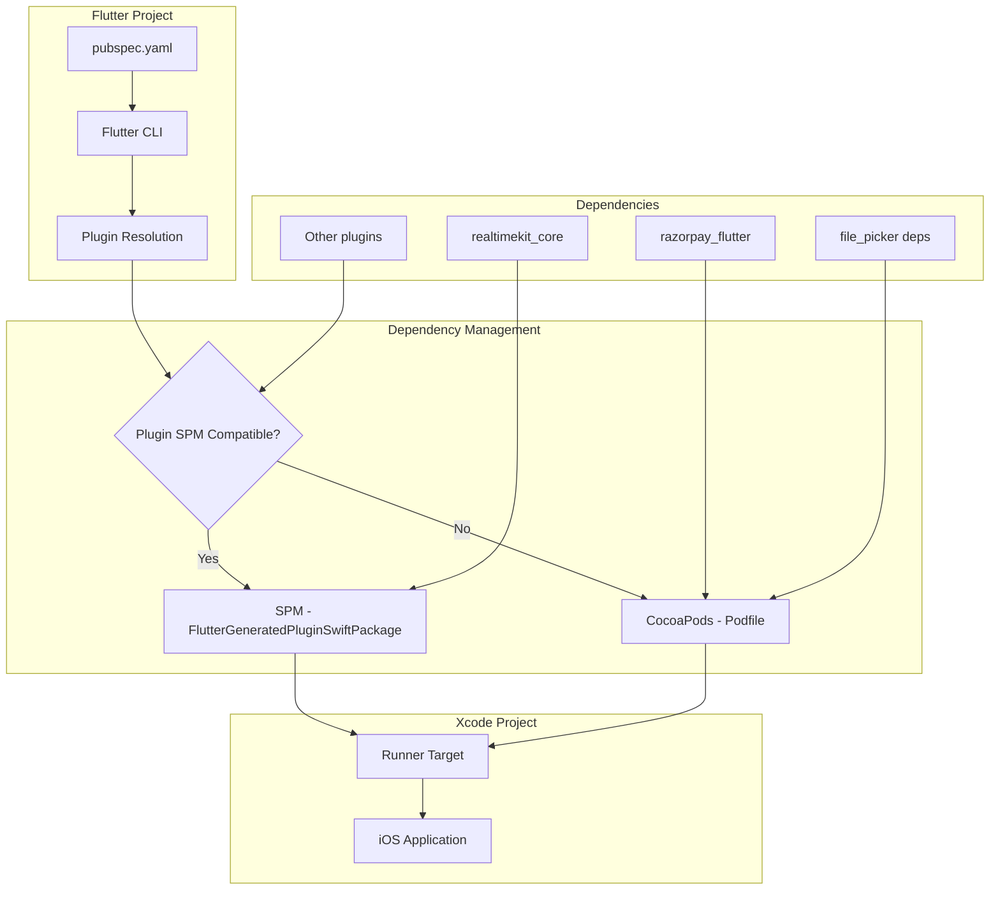
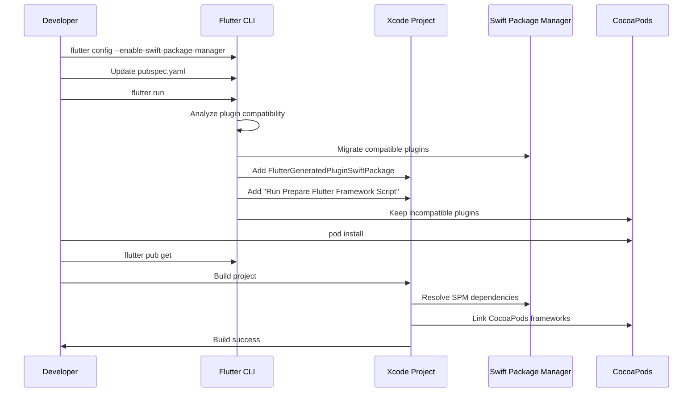
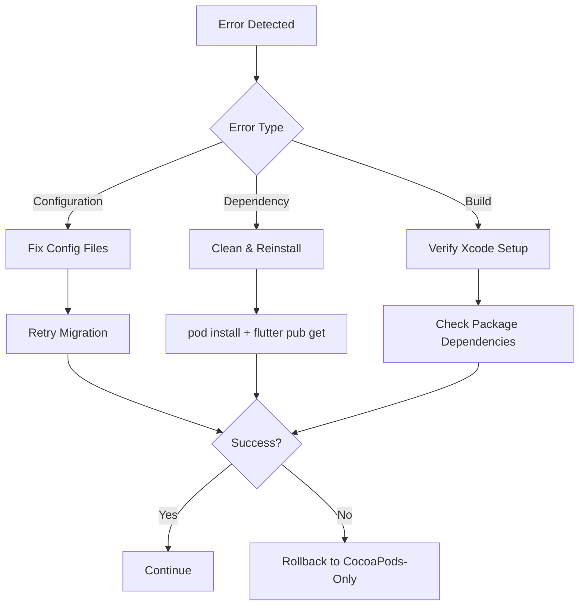

# Design Document: Swift Package Manager Migration

## Overview

This design describes the migration of a Flutter iOS project from CocoaPods-only dependency management to hybrid mode, where Swift Package Manager (SPM) and CocoaPods coexist. The migration enables the use of SPM-only packages while maintaining CocoaPods-only dependencies.

The migration follows Flutter's official hybrid mode approach, where Flutter automatically migrates SPM-compatible plugins while leaving incompatible plugins on CocoaPods. This is a configuration change rather than a code rewrite, leveraging Flutter's built-in migration tooling.

### Key Design Decisions

1. **Hybrid Mode Over Full SPM Migration**: We use hybrid mode because razorpay_flutter and some file_picker dependencies don't support SPM yet
2. **Automated Migration**: We rely on Flutter's automatic migration system rather than manual configuration
3. **Minimal Code Changes**: The migration is primarily configuration-based, requiring no application code changes
4. **Incremental Approach**: We enable SPM, trigger migration, then verify each step before proceeding

## Architecture

### System Components



### Migration Flow



## Components and Interfaces

### 1. Flutter Configuration

**Purpose**: Enable SPM support at both global and project levels

**Configuration Files**:
- Global: `~/.flutter_settings` (modified by `flutter config`)
- Project: `pubspec.yaml` (flutter.enable-swift-package-manager)

**Interface**:
```yaml
# pubspec.yaml
flutter:
  enable-swift-package-manager: true
```

**Behavior**:
- When enabled, Flutter CLI analyzes plugins for SPM compatibility during `flutter run`
- Triggers automatic migration of compatible plugins
- Generates FlutterGeneratedPluginSwiftPackage

### 2. Plugin Resolution System

**Purpose**: Determine which dependency manager handles each plugin

**Decision Logic**:
```
For each plugin in pubspec.yaml:
  If plugin has ios/[plugin_name].podspec.json with "swift_package_manager_enabled": true:
    Migrate to SPM
  Else:
    Keep on CocoaPods
```

**Known Plugin Classifications**:

SPM-Compatible (will migrate):
- connectivity_plus
- device_info_plus
- image_picker_ios
- package_info_plus
- permission_handler_apple
- share_plus
- shared_preferences_foundation
- url_launcher_ios

CocoaPods-Only (will remain):
- razorpay_flutter (explicitly not SPM-compatible)
- file_picker (dependencies: DKImagePickerController, DKPhotoGallery, SDWebImage, SwiftyGif)
- flutter_pdfview
- fluttertoast
- open_filex

SPM-Only (new):
- realtimekit_core

### 3. FlutterGeneratedPluginSwiftPackage

**Purpose**: Xcode package that manages all SPM-migrated Flutter plugins

**Structure**:
```
FlutterGeneratedPluginSwiftPackage/
├── Package.swift (generated by Flutter)
└── Sources/
    └── FlutterGeneratedPluginSwiftPackage/
        └── FlutterGeneratedPluginSwiftPackage.swift
```

**Package.swift Content** (example):
```swift
// swift-tools-version: 5.9
import PackageDescription

let package = Package(
    name: "FlutterGeneratedPluginSwiftPackage",
    platforms: [
        .iOS("15.0")
    ],
    products: [
        .library(name: "FlutterGeneratedPluginSwiftPackage", targets: ["FlutterGeneratedPluginSwiftPackage"])
    ],
    dependencies: [
        .package(url: "https://github.com/flutter/packages", from: "1.0.0"),
        .package(url: "https://github.com/example/realtimekit_core", from: "0.1.3")
    ],
    targets: [
        .target(
            name: "FlutterGeneratedPluginSwiftPackage",
            dependencies: []
        )
    ]
)
```

**Integration**:
- Added to Xcode project's Package Dependencies
- Linked to Runner target
- Automatically updated by Flutter when plugins change

### 4. Podfile Configuration

**Purpose**: Manage CocoaPods dependencies in hybrid mode

**Updated Podfile**:
```ruby
# Uncomment this line to define a global platform for your project
platform :ios, '15.0'

# CocoaPods analytics sends network stats synchronously affecting flutter build latency.
ENV['COCOAPODS_DISABLE_STATS'] = 'true'

project 'Runner', {
  'Debug' => :debug,
  'Profile' => :release,
  'Release' => :release,
}

def flutter_root
  generated_xcode_build_settings_path = File.expand_path(File.join('..', 'Flutter', 'Generated.xcconfig'), __FILE__)
  unless File.exist?(generated_xcode_build_settings_path)
    raise "#{generated_xcode_build_settings_path} must exist. If you're running pod install manually, make sure flutter pub get is executed first"
  end

  File.foreach(generated_xcode_build_settings_path) do |line|
    matches = line.match(/FLUTTER_ROOT\=(.*)/)
    return matches[1].strip if matches
  end
  raise "FLUTTER_ROOT not found in #{generated_xcode_build_settings_path}. Try deleting Generated.xcconfig, then run flutter pub get"
end

require File.expand_path(File.join('packages', 'flutter_tools', 'bin', 'podhelper'), flutter_root)

flutter_ios_podfile_setup

target 'Runner' do
  use_frameworks!
  use_modular_headers!

  flutter_install_all_ios_pods File.dirname(File.realpath(__FILE__))
  
  target 'RunnerTests' do
    inherit! :search_paths
  end
end

post_install do |installer|
  installer.pods_project.targets.each do |target|
    flutter_additional_ios_build_settings(target)
    target.build_configurations.each do |config|
      config.build_settings['IPHONEOS_DEPLOYMENT_TARGET'] = '15.0'
    end
  end
end
```

**Key Changes**:
- Deployment target explicitly set to 15.0
- `flutter_install_all_ios_pods` automatically excludes SPM-migrated plugins
- Post-install hook ensures consistent deployment target

### 5. Xcode Scheme Configuration

**Purpose**: Ensure Flutter framework is prepared before builds

**Pre-Action Script**: "Run Prepare Flutter Framework Script"
```bash
"$FLUTTER_ROOT/packages/flutter_tools/bin/xcode_backend.sh" prepare
```

**Configuration**:
- Added to "Run" scheme
- Executes before "Build" phase
- Provides build environment: Runner

**Purpose**:
- Ensures Flutter framework is up-to-date
- Synchronizes plugin registrations
- Prepares SPM package dependencies

### 6. Deployment Target Management

**Purpose**: Ensure consistent iOS 15.0 deployment target across all configurations

**Locations**:
1. **project.pbxproj**: `IPHONEOS_DEPLOYMENT_TARGET = 15.0`
2. **Podfile**: `platform :ios, '15.0'` and post_install hook
3. **FlutterGeneratedPluginSwiftPackage**: `platforms: [.iOS("15.0")]`

**Validation**:
```bash
# Check project.pbxproj
grep -A 5 "IPHONEOS_DEPLOYMENT_TARGET" ios/Runner.xcodeproj/project.pbxproj

# Check Podfile
grep "platform :ios" ios/Podfile

# Check Package.swift (after generation)
grep "platforms:" ios/Flutter/ephemeral/Packages/FlutterGeneratedPluginSwiftPackage/Package.swift
```

## Data Models

### Plugin Metadata

```yaml
# Structure in pubspec.yaml
dependencies:
  plugin_name: ^version
  
# Plugin's ios/[plugin_name].podspec.json
{
  "name": "plugin_name",
  "version": "1.0.0",
  "swift_package_manager_enabled": true,  # Indicates SPM support
  "platforms": {
    "ios": "15.0"
  }
}
```

### Migration State

```yaml
# Tracked implicitly through:
# 1. pubspec.yaml flutter.enable-swift-package-manager
# 2. Presence of FlutterGeneratedPluginSwiftPackage in Xcode
# 3. Contents of Podfile.lock (shows remaining CocoaPods dependencies)

migration_state:
  spm_enabled: boolean
  spm_plugins: [string]  # List of plugins migrated to SPM
  cocoapods_plugins: [string]  # List of plugins remaining on CocoaPods
  deployment_target: string  # iOS version (15.0)
```

### Dependency Resolution Result

```yaml
# Output of flutter pub get with SPM enabled
dependencies:
  realtimekit_core:
    source: spm
    version: 0.1.3
  razorpay_flutter:
    source: cocoapods
    version: current
  connectivity_plus:
    source: spm  # Migrated from CocoaPods
    version: current
  # ... other dependencies
```

## Error Handling

### Error Categories and Responses

1. **Flutter SDK Version Too Old**
   - Detection: `flutter --version` shows < 3.24.0
   - Response: Display error message with upgrade instructions
   - Recovery: User must upgrade Flutter SDK

2. **SPM Configuration Failure**
   - Detection: `flutter config --enable-swift-package-manager` fails
   - Response: Check Flutter installation integrity
   - Recovery: Reinstall Flutter or fix permissions

3. **Plugin Resolution Conflict**
   - Detection: Plugin requires both SPM and CocoaPods simultaneously
   - Response: Report conflict with plugin name
   - Recovery: Check plugin documentation for compatibility

4. **Deployment Target Mismatch**
   - Detection: Different deployment targets in project.pbxproj, Podfile, Package.swift
   - Response: Report mismatched values
   - Recovery: Manually align all deployment targets to 15.0

5. **Missing FlutterGeneratedPluginSwiftPackage**
   - Detection: Package not added to Xcode after `flutter run`
   - Response: Verify SPM is enabled in both global and project config
   - Recovery: Re-run migration steps

6. **CocoaPods Installation Failure**
   - Detection: `pod install` exits with error
   - Response: Display CocoaPods error message
   - Recovery: Clean Pods directory, update CocoaPods, retry

7. **Xcode Build Failure**
   - Detection: Build fails with linking errors
   - Response: Check if both SPM and CocoaPods dependencies are linked
   - Recovery: Verify Runner target links both dependency types

8. **Dependency Not Found**
   - Detection: realtimekit_core cannot be resolved via SPM
   - Response: Verify package URL and version
   - Recovery: Check package availability, update version constraint

### Error Recovery Strategy



### Rollback Procedure

If migration fails and cannot be recovered:

1. Set `enable-swift-package-manager: false` in pubspec.yaml
2. Run `flutter config --no-enable-swift-package-manager`
3. Remove FlutterGeneratedPluginSwiftPackage from Xcode project
4. Run `flutter clean`
5. Run `pod install`
6. Run `flutter pub get`
7. Rebuild project

## Testing Strategy

### Dual Testing Approach

This migration requires both unit tests and property-based tests to ensure correctness:

- **Unit tests**: Verify specific configuration states, file contents, and migration steps
- **Property tests**: Verify universal properties about dependency resolution and build consistency

### Property-Based Testing

We will use property-based testing to verify correctness properties across different plugin configurations and migration states. For Dart/Flutter projects, we'll use the `test` package with custom property test helpers, or a library like `glados` if available.

**Configuration**:
- Minimum 100 iterations per property test
- Each test tagged with: **Feature: swift-package-manager-migration, Property {number}: {property_text}**

### Unit Testing Strategy

Unit tests will focus on:
- Configuration file validation (pubspec.yaml, Podfile)
- Xcode project structure verification
- Deployment target consistency checks
- Specific error conditions and edge cases
- Integration between SPM and CocoaPods

### Test Environment

- Flutter SDK 3.24+
- Xcode 15+
- CocoaPods 1.12+
- iOS Simulator or device with iOS 15.0+

### Testing Phases

1. **Pre-Migration Tests**: Verify initial CocoaPods-only state
2. **Configuration Tests**: Verify SPM enablement
3. **Migration Tests**: Verify automatic plugin migration
4. **Integration Tests**: Verify hybrid mode functionality
5. **Rollback Tests**: Verify rollback procedure works


## Correctness Properties

A property is a characteristic or behavior that should hold true across all valid executions of a system—essentially, a formal statement about what the system should do. Properties serve as the bridge between human-readable specifications and machine-verifiable correctness guarantees.

### Property 1: Plugin Migration Correctness

*For any* set of Flutter plugins in pubspec.yaml, when SPM is enabled and migration is triggered, all plugins that support SPM should be migrated to SPM management, and all plugins that do not support SPM should remain under CocoaPods management.

**Validates: Requirements 2.3, 3.2, 3.3**

### Property 2: Podfile Hybrid Mode Correctness

*For any* migration state in hybrid mode, the Podfile should include all and only the plugins managed by CocoaPods, and should exclude all plugins managed by SPM.

**Validates: Requirements 7.1, 7.2**

### Property 3: Deployment Target Consistency

*For any* completed migration, the iOS deployment target specified in project.pbxproj, Podfile, and FlutterGeneratedPluginSwiftPackage should all be identical.

**Validates: Requirements 6.4**

### Property 4: Plugin Functionality After Migration

*For any* plugin that was successfully migrated to SPM or kept on CocoaPods, the plugin should be importable and its core functionality should be accessible in the iOS application code.

**Validates: Requirements 10.3**

### Property 5: Rollback Completeness

*For any* project in hybrid mode, when rollback is executed, all plugins should be restored to CocoaPods management and the project should build successfully without SPM dependencies.

**Validates: Requirements 11.4**
